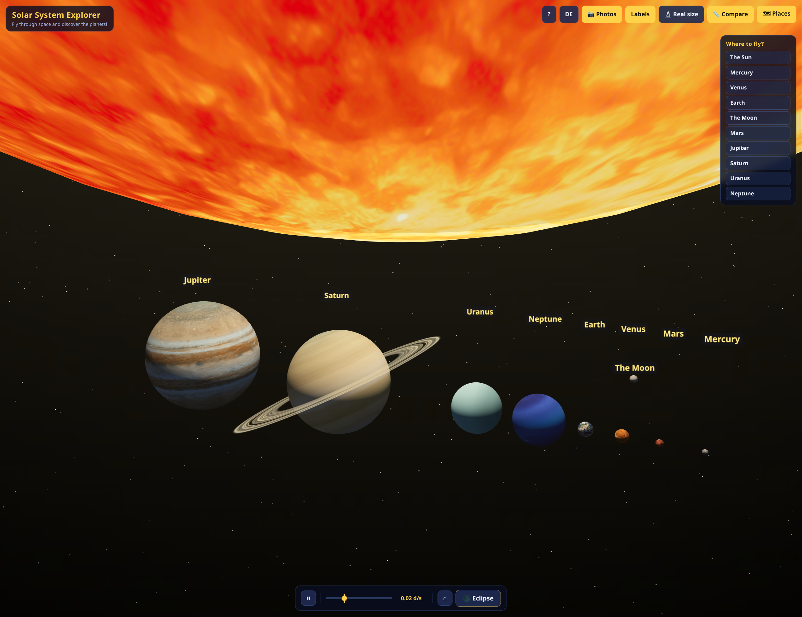

# Solar System Explorer

A 3D, browser-based solar system for kids: fly through space with WASD + mouse,
tap or click any planet to travel to it, and watch a real solar eclipse play out
over Earth. Works on desktop **and on phones/tablets** — the layout adapts to
small screens and all controls have touch equivalents (see below).

By default everything (textures included) is generated **procedurally in the browser**
— no image files, no server. There is also an optional **📷 Photos**
mode that swaps in real planet photographs (loaded from the internet); if a photo can't
be loaded, that body simply keeps its procedural texture, so you never see broken images.




## Run it

Just open `index.html` in a modern browser (Chrome, Edge, Firefox, Safari).

That's it. No build step, no dependencies to install.

> **Internet needed to start:** the page loads the 3D engine (Three.js) from a CDN
> (`cdn.jsdelivr.net`) on startup, so an internet connection is required for the app
> to launch. The download is verified against a SHA-384 checksum (Subresource Integrity)
> *before* it runs, so tampered or altered content is never executed.
> If the CDN is unreachable, a friendly error screen explains what happened.
> (Your browser may keep the file in its cache after the first visit, which can let
> a reload work offline — but that's not guaranteed.)
>
> The optional 📷 Photos mode additionally downloads real planet textures (from
> `raw.githubusercontent.com`). Any photo that fails to load simply keeps its
> procedural texture.

Optional — serve it statically if you prefer:

```bash
cd explore_sol
python3 -m http.server 8000
# then open http://localhost:8000
```

## Controls

| Key / Action | What it does |
|---|---|
| Mouse drag | look around |
| Touch & drag (one finger) | look around |
| Pinch (two fingers) | zoom in / out |
| Drag with two fingers | fly in the direction you drag (map-style pan) |
| Tap a planet / the Sun / the Moon | fly to it and follow it |
| `W` `A` `S` `D` | fly forward / left / back / right |
| `Space` | fly up |
| `Ctrl` | fly down |
| `Shift` (hold) | fly faster |
| Mouse wheel | zoom in / out |
| Click a planet / the Sun / the Moon | fly to it and follow it |
| `Esc` | stop following / close window |
| Bottom bar | pause, or set the time speed on a continuous slider (0.001 … 100 days per second; releasing near the marker snaps back to the default 0.02 d/s) |
| 🌑 Eclipse button | start a solar eclipse over Earth |
| `?` | help / controls |
| EN / DE button | switch language (remembered) |
| 📷 Photos button | switch between real photos and built-in drawings (remembered) |
| 🔬 Real size button | show every planet at its true size relative to the Sun — they get tiny! (remembered) |
| 📏 Compare button | line up all 8 planets side by side at their true relative sizes, with the Sun above as light source (remembered) |
| 🗺 Places button | show/hide the list of all places you can fly to (remembered) |
| Labels button | show/hide name labels |

## Features

- **Sun + all 8 planets** with realistic relative sizes, orbital periods and tilts
  (Uranus rolls on its side, Venus spins backwards), plus Earth's Moon.
- **Two texture modes**:
  - *Procedural (default, offline)*: real-looking continents, oceans, ice caps and
    drifting clouds on Earth; Jupiter's bands and Great Red Spot; Saturn's rings with
    the Cassini division; craters on the Moon; a churning solar surface.
  - *📷 Photos*: real planet photographs for the Sun, all 8 planets and the Moon,
    loaded from the internet. Your choice is remembered; any photo that fails to load
    (e.g. offline) falls back to its procedural texture automatically. All photos
    come from [Solar-Wanderer](https://github.com/hyqzz/Solar-Wanderer)
    (solarsystemscope.com, CC-BY-4.0 — NASA/USGS/SDO data), including a real NASA
    cloud photo for Earth's drifting cloud layer. In-app credits are shown in the
    help window (?).
- **Correct lighting & shadows**: one light at the Sun — every planet shows a crisp
  day/night terminator. The Moon's and the rings' shadows are computed *analytically*
  in the shaders (each surface point ray-marches toward the Sun and tests it against
  the Moon / the ring plane), so they are resolution-independent: the Cassini gap
  casts a razor-sharp line, eclipses get physically correct umbra + penumbra, and
  Saturn's rings cast *and* receive shadows (the planet darkens the far side of the
  rings). No shadow maps at all — cheaper and always crisp.
- **Asteroid belt** between Mars and Jupiter (4500 instanced rocks in two layers: 3000 main
  rocks + 1500 tiny dust fragments).
- **Time controls**: pause, or run at any speed from 0.001 to 100 days per second on a
  logarithmic slider (releasing near the marker snaps back to the default 0.02 d/s —
  the slow speeds are great for watching the Moon's shadow cross Earth).
- **🔬 Real size mode**: every planet at its true radius relative to the Sun —
  Mercury becomes a speck, Jupiter still dwarfs everything else.
- **📏 Compare mode**: all 8 planets lined up side by side (largest → smallest) at
  their true *relative* sizes, with the Sun above the row at its true scale too — so
  vast that only its lower limb fits on screen. It acts as the light source,
  so each planet keeps a proper day/night terminator. Orbits and the asteroid belt
  are hidden; the name labels form one neat line above the row. Great for seeing how
  big the planets really are compared to each other.
- **🗺 Places list**: a hideable panel listing every place you can visit — click an entry
  to fly there, no hunting for dark dots. The place you're following is highlighted.
- **Bilingual UI** (English / German), language choice is remembered.
- **Phone & tablet support**: the interface adapts to small screens — compact
  emoji buttons, the info card and the places list become bottom sheets, and all
  controls work with touch (one finger = look around, tap = fly there, pinch =
  zoom, two-finger drag = fly). The help window (?) automatically shows the
  touch instructions on touch devices.

## The eclipse mode 🌑

Press the **🌑 Eclipse** button and the camera flies to a viewing spot above Earth:

1. The Moon is placed exactly between Sun and Earth (a "new moon at a node" —
   in reality the Moon's orbit is tilted ~5°, so this only happens near the
   points where its orbit crosses the Sun–Earth plane).
2. Time slows to 0.1 days/second so you can watch the shadow travel across Earth.
3. Two cones are drawn from the Moon:
   - **Umbra** (dark) — the small spot of *totality*, where the Sun is fully covered.
     People standing in this spot see a total solar eclipse: day turns to night for
     a few minutes.
   - **Penumbra** (blue, wider) — the partial-shadow zone around it, where only part
     of the Sun is covered.
4. Because the Moon and Earth keep moving, the umbra spot wanders across the planet
   from west to east — just like a real eclipse path.

Press **🌑 Eclipse** again (or `Esc`, or any speed button) to return to normal time
and the Moon's usual tilted orbit.

## Notes

- Sizes and distances are compressed for playability (a true-scale solar system
  would be mostly empty black), but relative ordering, periods and tilts are real.
- **Orbits are real ellipses**: each planet follows its actual Keplerian orbit —
  eccentricity, inclination to the ecliptic, ascending node and perihelion
  direction are the NASA "Planetary Fact Sheet" mean elements for J2000. So the
  orbits are visibly non-circular (Mercury's most) and each lies in its own
  slightly tilted plane instead of one flat disc. Kepler's equation is solved
  every frame, so planets also speed up near perihelion and slow down at
  aphelion, as they really do. At t=0 the planets sit where they actually were
  on Jan 1, 2000.
- The whole app is a single self-contained `index.html` (~2200 lines).

## License

The code in this repository is licensed under the **MIT License** (see [LICENSE](LICENSE)).

The optional 📷 Photos mode loads third-party textures from the internet at runtime
(they are not part of this repository): all planet photos come from
[Solar-Wanderer](https://github.com/hyqzz/Solar-Wanderer) based on
[solarsystemscope.com](https://solarsystemscope.com/textures/) (NASA/USGS/SDO data,
CC-BY-4.0), and the 3D engine is [Three.js](https://threejs.org) (MIT). Full credits
are shown in-app in the help window (`?`).
